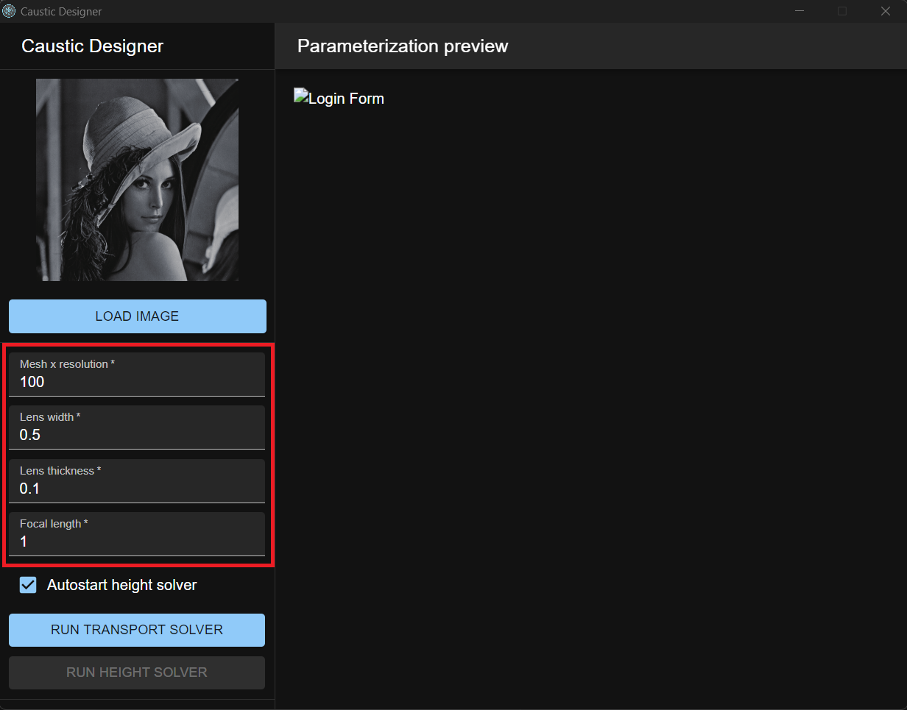

# Poisson-Based Continuous Surface Generation for Goal-Based Caustics

## Overview

This application implements the method described in the paper [Poisson-Based Continuous Surface Generation for Goal-Based Caustics](http://nishitalab.org/user/egaku/tog14/continuous_caustics.pdf).

Result simulated with Blender using LuxRender:

## Features

- Implementation of the Poisson-based continuous surface generation algorithm.
- exports a solidified .obj
- the only c++17 non-standard dependancy is libpng
- can export the the inverse transport map
- multithreaded poisson solver

## Usage

1. load your image

2. edit parameters

3. run algorithms

### Sample Output
<table style="width: 100%;">
  <tr>
    <th style="text-align: center;"></th>
    <th style="text-align: center;">input_image</th>
    <th style="text-align: center;">parameterization</th>
    <th style="text-align: center;">inverted parameterization</th>
    <th style="text-align: center;">3d_model</th>
    <th style="text-align: center;">simulation</th>
  </tr>
  <tr>
    <td style="text-align: center;">Lena</td>
    <td style="text-align: center;"></td>
    <td style="text-align: center;"></td>
    <td style="text-align: center;"></td>
    <td style="text-align: center;"></td>
    <td style="text-align: center;"></td>
  </tr>
  <tr>
    <td style="text-align: center;">Siggraph logo</td>
    <td style="text-align: center;"></td>
    <td style="text-align: center;"></td>
    <td style="text-align: center;"></td>
    <td style="text-align: center;"></td>
    <td style="text-align: center;"></td>
  </tr>
  <tr>
    <td style="text-align: center;">Hello World</td>
    <td style="text-align: center;"></td>
    <td style="text-align: center;"></td>
    <td style="text-align: center;"></td>
    <td style="text-align: center;"></td>
    <td style="text-align: center;"></td>
  </tr>
</table>

transport from an image to an almost uniform distribution:

## Prototype

Machined acrylic prototype:

Shadow of the machined prototype:

## Future plans

1. updated height solver -> this will allow more freedom in the lens design
2. reflective caustics -> is currently not that usefull because of the limited freedom in the height solver
3. circular lenses
4. create portable builds for Win/Linux in releases
5. GUI application

## Contributing

Contributions are welcome! If you'd like to contribute to this project, please follow these steps:

1. Fork the repository
2. Create a new branch (`git checkout -b feature`)
3. Make your changes
4. Commit your changes (`git commit -am 'Add new feature'`)
5. Push to the branch (`git push origin feature`)
6. Create a new Pull Request

## License

This project uses the MIT License.

## Acknowledgements

Thank you to Yue et al for their awesome research paper.

I would also like to thank Matt Ferraro for providing [their informative article](https://mattferraro.dev/posts/caustics-engineering) about the paper.

